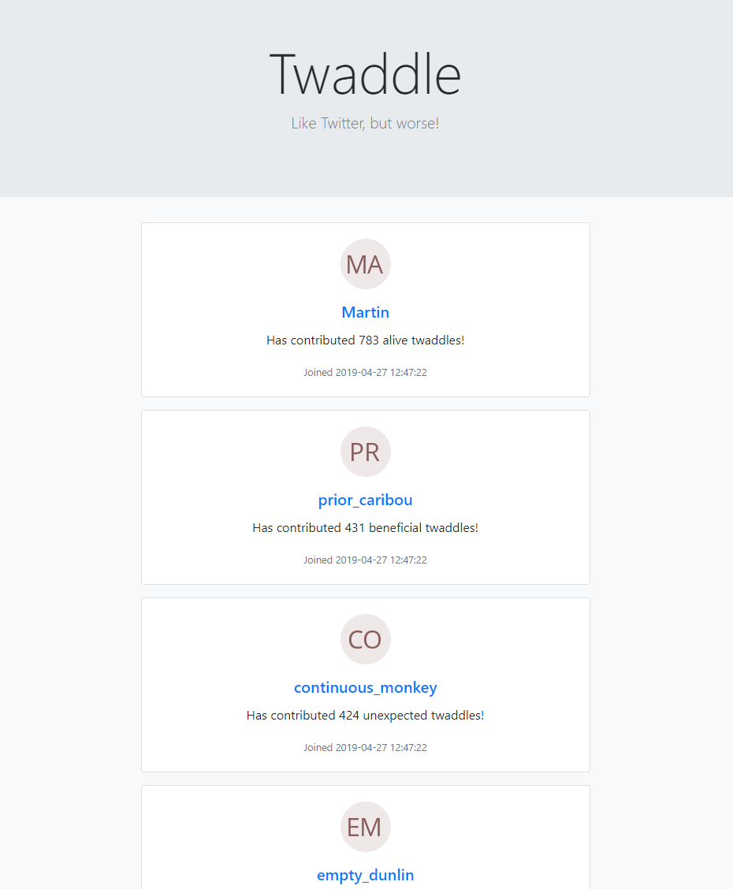
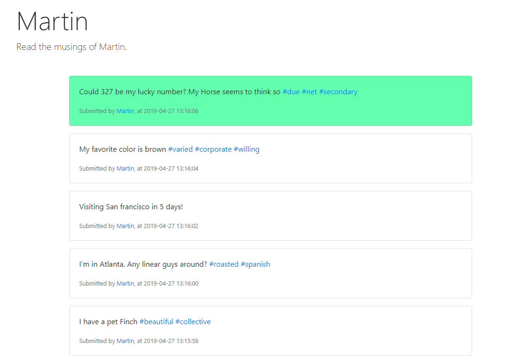
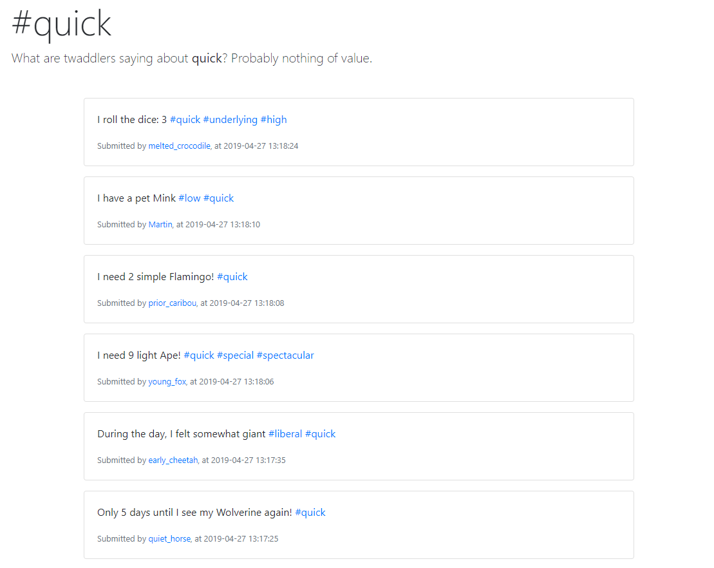

# twaddle

Twitter 🦆 clone using Spring Cloud Stream, ElasticSearch, and RabbitMQ.

I wanted to enhance my understanding of semi-structured data search and messaging, and thought that Twitter was a good example project. Twitter exposes a simple user experience with hardcore technical details underneath, which I was inspired to give a shot at a very small scale.

I wanted to work with "real data", so I collected word lists of verbs, nouns, animals, cities, to generate continuous, somewhat literate nonsense.

It also gave me the chance to work with a little bit of frontend technologies, to consume twaddle streams, update UI as streams are consumed, use regex to make click-able hashtags (again inspired by Twitter), and so on.

## Primary Challenges Solved

* Implement an event driven, binder agnostic infrastructure using or ready for shared messaging services (Spring Cloud Stream)
* Implement a search engine for hashtags (ElasticSearch)
* Implement a deployment pipeline using Docker Compose (Maven, Fabric8)

## Secondary Challenges Solved

* Expose "twaddles" as an unidirectional stream of data (SSE)
* Consume stream of twaddles from JS client to update UI in real time (JS EventSource)
* Use a template engine I've not used before (Mustache)
* Generate a continuous stream of nonsense for all users

## Other Learnings

* Using Kibana to visualize data from ElasticSearch indices
* Spring Boot will override application properties with environment variables, converting from dot-case to snake-case
** E.g.: `elasticsearch.address` becomes `ELASTICSEARCH_ADDRESS`
** This makes it really easy to deploy Spring Boot apps to a Docker environment
* Spring Cloud Stream bypasses message binder if publisher and subscriber resides in the same application context
* Using Spring WebFlux, it is much more natural to implement SSE, however Spring also has an `SseEmitter` for the same purpose

## Build

Fabric8 has been added to this project; making building the artifact and Docker image trivial:
```
mvn package fabric8:build
```

Will produce a Docker image called: `twaddle/twaddle-app`

## Deploy

Docker Compose files are available to deploy infrastructure only, or the entire system. Uses environment variables to pass appropriate parameters to Spring Boot Autoconfiguration.

```
docker-compose -f Docker/docker-compose.yml up -d
```

## Media

#### Frontpage


#### Twaddles by user (Green indicates real time update occurred)


#### Twaddles by hashtag

